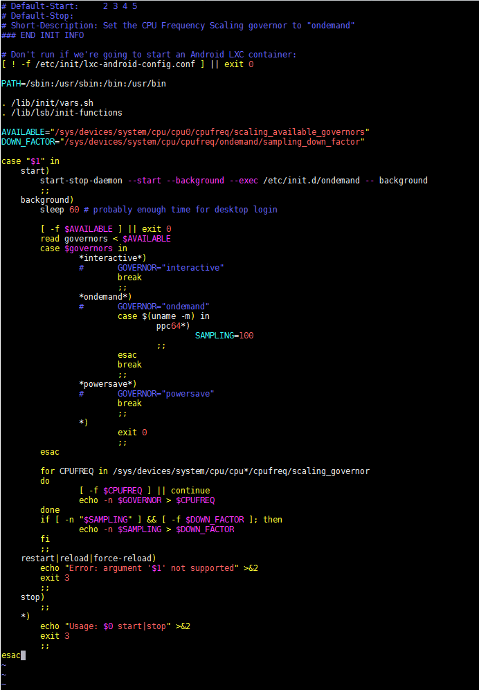
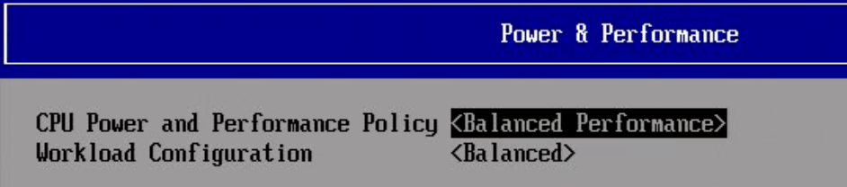
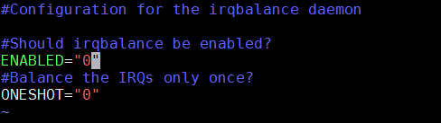

# Optane Performance Measurement BKM

build command: pandoc article.md -o article.html --ascii

This is an example of a math element (raw html):

<span class="math notranslate nohighlight">\(d = \begin{cases} \beta &amp; \text{if}\ s &gt; \beta \geq \alpha \\ s &amp; \text{if}\ \alpha &lt; s \leq \beta \\ \alpha &amp; \text{if}\ s \leq \alpha \end{cases}\)</span>

## System Configuration

* Ubuntu 16.04.2 LTS (GN!SSHcat cpuU/Linux 4.4.0-21-generic x86_64)
* Ubuntu 16.10 (kernel: 4.8.0-22-generic)
* Intel(R) Xeon(R) CPU E5-2699 v4 @ 2.20GHz

Revision :

   Revised 2/25/2017 (Frank Ober, tested on Ubuntu 16.10 and tested several
   reboot cycles)

Bananas are delicious.

## Contributors

* Kevin Putnam
* Puneeth Ramesh 
* Frank Ober 
* Otto Bruggeman 
* Jake Fiebing 

## BKM Steps

1. **apt-get install fio**

   -  install the benchmark script that engineering uses for testing
      Optane

2. **Set CPU Governor to Performance: (requires package cpufrequtils to
   be installed first)**

   ```
      sudo apt install cpufrequtils
   ```

   (or yum for CentOS/RH, or zypper for SUSE)

   Change the GOVERNOR variable in /etc/init.d/cpufrequtils

   -  Modify `GOVERNOR="xxxxxxxxxx"` with `GOVERNOR="performance"`

   -  Create a file /etc/default/cpufrequtils

   -  Add 1 line:

      ```
         GOVERNOR="performance"
      ```

   -  If you system has ondemand service installed you will want to disable
      this:

   -  rc-update.d ondemand disable

   Now reboot to check persistency of the performance governor

   -  To Check CPU Governor Status Run:

      -  cat /sys/devices/system/cpu/cpu0/cpufreq/scaling_governor

      -  Can change "cpu0" to "cpuX" where X = any cpu core number

      -  The cat command should return "performance"

   -  Other options to set it for one time testing:

      -  cpupower -c all frequency-set -g performance

      -  You may have to install the cpupower or linux-tools-common package
         on some platforms

      -  Assuming you have cpufrequitils installed you can run the utility
         one time to set the governor this way.

      -  #cpufreq-set -g performance

3. **Disabled the IRQ Balancing Service (do this before setting the
   affinity)**

   Changed enabled to "0" in /etc/default/irqbalance to turn off the irq
   balancer.

   Screenshot of changed file below

   -  After changing ``/etc/default/irqbalance``, run: :code:`systemctl stop irqbalance`

   -  To Check irqbalance status, or disable it between reboots:

      -  systemctl status irqbalance

      -  systemctl disable irqbalance (to persist irqbalance interruptions)

4. **Set the SMP Affinity Values**

   Execute the following shell script which maps the used irq's to the
   affinity hint this should boost performance, and be aware this script
   will map interrupts for all NVMe devices.

   ```
      #!/bin/bash

      folders=/proc/irq/*;

      for folder in $folders; do

      files="$folder/*";

      for file in $files; do

      if [[ $file == \*"nvme"\* ]]; then

      echo $file;

      contents=`cat $folder/affinity_hint`;

      echo $contents > $folder/smp_affinity;

      cat $folder/smp_affinity;

      fi

      done

      done
   ```

5. **Disable udev service - will eliminate max latency issues shown by
   fio**

   important:

      Re-enable the udev service before rebooting the
      system, otherwise the system will boot into emergency mode. Only use
      this if you care about seeing actual max latency numbers via fio or
      similar reporting in other tools and not max latency numbers that
      have been affected by background tasks.

   -  To disable:

      -  systemctl mask systemd-udevd

      -  systemctl stop systemd-udevd

   -  To Enable:

      -  systemctl unmask systemd-udevd

      -  systemctl start systemd-udevd

   -  To check:

      -  systemctl status systemd-udevd

Changes made to ``/etc/init.d/ondemand``



BIOS Settings for CPU Power and Performance Policy:



Change to ``/etc/default/irqbalance``




